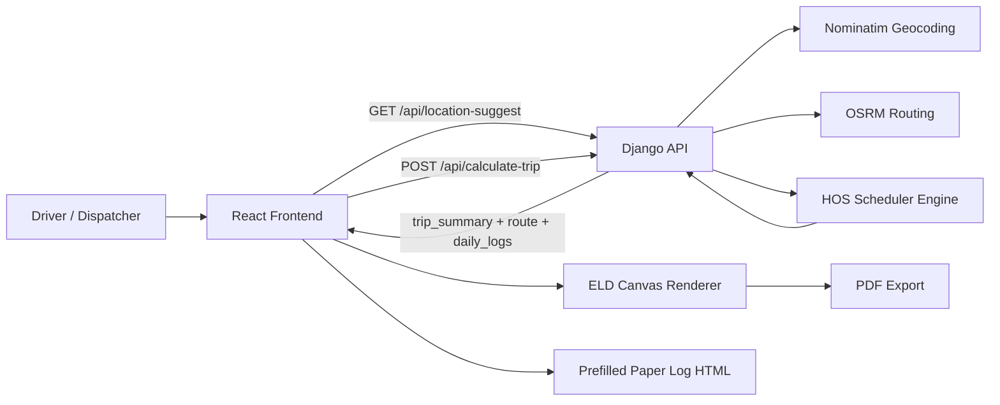
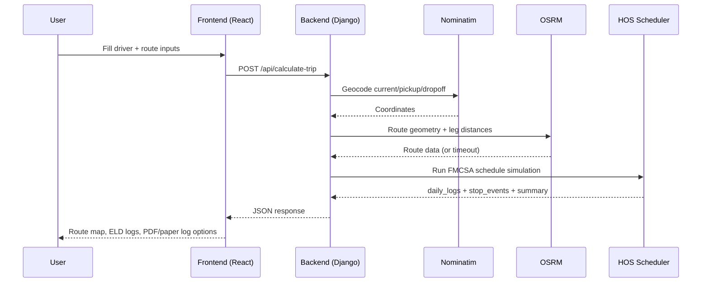
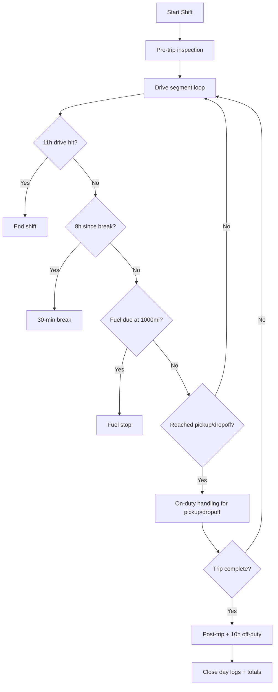
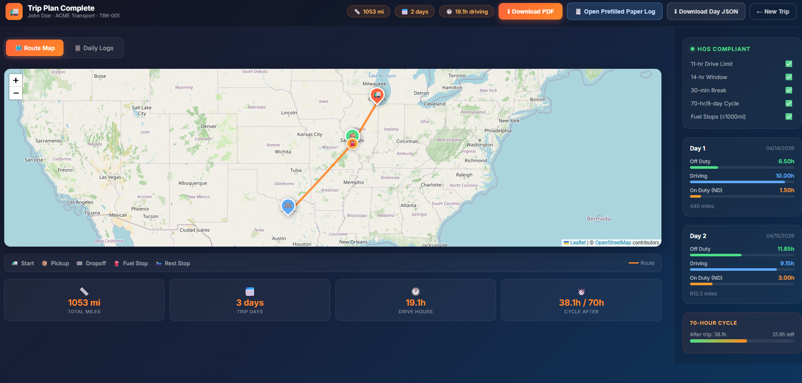
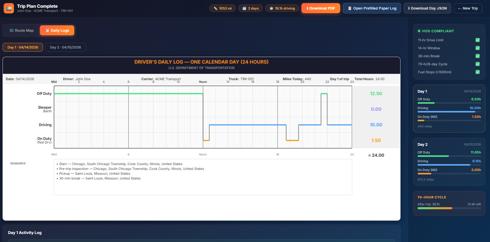
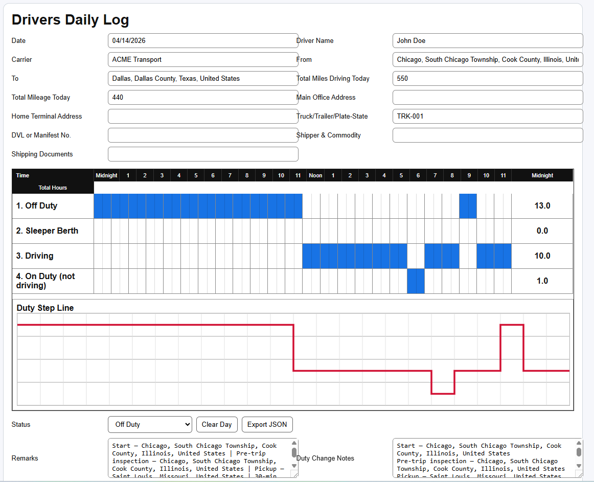

# TruckLog Pro — ELD Trip Planner

Full-stack ELD trip planning application that computes FMCSA-compliant schedules, visualizes route + stop strategy, renders daily ELD logs, and exports logs to PDF.

Live app: [https://eld-trip-planner-frontend.onrender.com/](https://eld-trip-planner-frontend.onrender.com/)

## Overview

This project takes a driver's trip inputs and returns:

- route summary and stop markers
- daily ELD logs (24-hour duty timelines)
- HOS-aware schedule across multiple days
- downloadable PDF logs
- prefilled paper-log HTML view

Core user flow:

1. Enter driver + trip inputs (current, pickup, dropoff, cycle used)
2. Fetch location suggestions from backend
3. Calculate trip and HOS schedule
4. Review map and daily logs
5. Export PDF or open prefilled paper log

## Architecture Diagram



## Request Flow (Trip Calculation)



## HOS Engine Flow



## Screenshots

### Route Map View


### Daily Logs View


### Prefilled Paper Log View


## Tech Stack

- **Backend**: Django 4.2, Django REST Framework, Gunicorn
- **Frontend**: React 18, Vite
- **Mapping**: Leaflet + OpenStreetMap tiles
- **Geocoding**: Nominatim
- **Routing**: OSRM (with fallback estimation)
- **PDF**: jsPDF (drawn from canvas log renderer)

## Repository Structure

```text
backend/
  config/
    settings.py          # Django settings, env-driven config
    urls.py              # Root URL routes
    wsgi.py              # Gunicorn/Django entrypoint
  eldapp/
    views.py             # API endpoints
    urls.py              # App URL routes
    geocoding.py         # Nominatim + OSRM utilities
    hos_calculator.py    # FMCSA HOS scheduler engine
    models.py            # (currently minimal)
  gunicorn.conf.py       # Gunicorn process/runtime tuning
  requirements.txt

frontend/
  src/
    App.jsx
    components/
      LandingPage.jsx
      MultiStepForm.jsx
      ResultsPage.jsx
      RouteMap.jsx
      ELDLogCanvas.jsx   # Canvas log renderer + normalization
    utils/
      api.js             # HTTP client and API calls
      pdfExport.js       # PDF export pipeline
  public/
    drivers-daily-log.html  # Prefilled paper-log HTML view
```

## API Endpoints

Base backend path: `/api`

- `GET /api/healthz/`
  - simple health response for service monitoring
- `GET /api/location-suggest/?q=<text>&limit=<n>`
  - location autocomplete suggestions (Nominatim-backed)
- `POST /api/calculate-trip/`
  - trip calculation + HOS schedule generation

Example request:

```json
{
  "driver_name": "John Doe",
  "carrier_name": "ACME Transport",
  "truck_number": "TRK-001",
  "current_location": "Chicago, IL",
  "pickup_location": "St Louis, MO",
  "dropoff_location": "Dallas, TX",
  "current_cycle_used": 14.5
}
```

## Key Code Snippets

### Backend API Route Wiring

```python
# backend/eldapp/urls.py
urlpatterns = [
    path('healthz/', HealthCheckView.as_view(), name='healthz'),
    path('location-suggest/', LocationSuggestView.as_view(), name='location-suggest'),
    path('calculate-trip/', CalculateTripView.as_view(), name='calculate-trip'),
]
```

### Trip Calculation Endpoint Skeleton

```python
# backend/eldapp/views.py
class CalculateTripView(APIView):
    def post(self, request):
        data = request.data
        # validate payload
        # geocode current/pickup/dropoff (parallel)
        # fetch route geometry + distances
        # run calculate_trip_schedule(...)
        # return driver_info + route + daily_logs + trip_summary
```

### HOS Rule Constants

```python
# backend/eldapp/hos_calculator.py
MAX_DRIVING_HOURS = 11.0
MAX_WINDOW_HOURS = 14.0
REQUIRED_OFF_DUTY_HOURS = 10.0
MAX_CYCLE_HOURS = 70.0
BREAK_TRIGGER_HOURS = 8.0
BREAK_DURATION_HOURS = 0.5
FUEL_INTERVAL_MILES = 1000.0
```

### Backend Environment-Driven Settings

```python
# backend/config/settings.py
DEBUG = os.environ.get('DJANGO_DEBUG', 'False') == 'True'
ALLOWED_HOSTS = os.environ.get('DJANGO_ALLOWED_HOSTS', 'localhost,127.0.0.1,0.0.0.0').split(',')
CORS_ALLOWED_ORIGINS = [origin.strip() for origin in os.environ.get('CORS_ALLOWED_ORIGINS', '').split(',') if origin.strip()]
CSRF_TRUSTED_ORIGINS = [origin.strip() for origin in os.environ.get('CSRF_TRUSTED_ORIGINS', '').split(',') if origin.strip()]
```

### Frontend API Client + Timeout Handling

```javascript
// frontend/src/utils/api.js
const api = axios.create({
  baseURL: import.meta.env.VITE_API_URL || '',
  timeout: 45000,
  headers: { 'Content-Type': 'application/json' },
})
```

### ELD Log Normalization Before Render

```javascript
// frontend/src/components/ELDLogCanvas.jsx
export function prepareLogForRender(log) {
  // normalize/clamp segments to 0..24
  // fill gaps with off-duty
  // merge adjacent same-status segments
  // recompute totals from normalized segments
  return { segments, totals, totalHours: 24 }
}
```

## HOS Rules and Scheduling Logic

Primary rule engine file: `backend/eldapp/hos_calculator.py`

Rules implemented in scheduler logic:

- 11-hour max driving per shift
- 14-hour on-duty window
- 30-minute break after 8 cumulative driving hours
- 10 consecutive off-duty between shifts
- 70-hour / 8-day cycle limit
- fuel stop at least every 1,000 miles
- pre-trip and post-trip inspections
- pickup and dropoff on-duty-not-driving segments

How it works:

1. Build a `TripScheduler` with route distances and cycle-used input
2. Simulate timeline segments (off-duty, driving, on-duty ND, sleeper)
3. Split/close days automatically at 24-hour boundaries
4. Generate `daily_logs` with per-status totals and remarks
5. Return trip summary + stops + logs to frontend

Safety/guardrails:

- invalid cycle ranges rejected at API level
- exhausted cycle hours produce clear validation errors
- simulation has loop/window guards to avoid runaway scenarios

## Frontend Rendering Model

### Trip Input + Suggestion Flow

`frontend/src/components/MultiStepForm.jsx`

- collects driver + trip fields
- requests suggestions with debounce and cancellation
- caches suggestions client-side
- submits to `/api/calculate-trip/`

### Results + Exports

`frontend/src/components/ResultsPage.jsx`

- route map tab + daily logs tab
- opens prefilled paper log (`drivers-daily-log.html`)
- exports selected data to JSON
- exports complete logs to PDF

### ELD Canvas Rendering

`frontend/src/components/ELDLogCanvas.jsx`

- normalizes segments to full 24-hour coverage
- merges adjacent same-status segments
- recomputes totals from normalized data
- draws:
  - header metadata
  - duty grid
  - status lines + transitions
  - totals and remarks

## Configuration

### Backend env vars

- `DJANGO_SECRET_KEY`
- `DJANGO_DEBUG`
- `DJANGO_ALLOWED_HOSTS`
- `CORS_ALLOWED_ORIGINS`
- `CORS_ALLOW_ALL_ORIGINS`
- `CSRF_TRUSTED_ORIGINS`
- `DATABASE_URL` (optional; defaults to SQLite when unset)

### Frontend env vars

- `VITE_API_URL` (backend base URL)

## Local Development

### Backend

```bash
cd backend
pip install -r requirements.txt
python manage.py migrate
gunicorn config.wsgi:application --config gunicorn.conf.py
```

### Frontend

```bash
cd frontend
npm install
npm run dev -- --host 0.0.0.0 --port 5173
```

## Production Runtime

Backend runs with Gunicorn (`backend/gunicorn.conf.py`) and exposes `/api/healthz/` for health checks.

## Notes

- Route provider is OSRM public service; if unavailable/slow, fallback route estimation is used.
- Current app does not require user authentication.
- Persistent database is optional for current stateless trip-calculation workflow.
